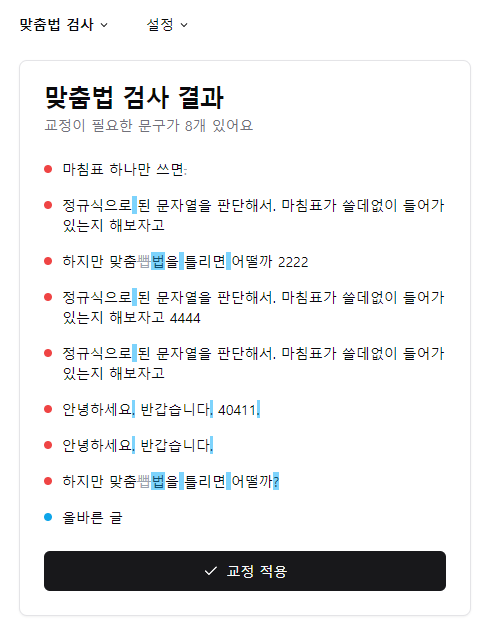

# 피그말싸미 (Figmalssamy)

## 개요

피그마용 한국어 맞춤법 검사기입니다.

특정 영역(Frame 또는 Text Node)을 선택하면 맞춤법 검사 및 교정을 수행합니다.

맞춤법 검사는 다음(Daum) 맞춤법 검사 도구를 활용해서 처리합니다.

## 기타 교정 옵션

#### 마침표 처리

* 문장이 한 문장인 경우 마침표를 처리하지 않는 옵션이 기본적으로 수행됩니다. (기본값)
* 필요한 경우 설정 > 교정 옵션에서 해당 기능을 끄고 항상 마침표를 추가할 수 있습니다.

### 라이선스

MIT License

## 피그마 플러그인
https://www.figma.com/community/plugin/1351591895654343346

## 스크린샷

